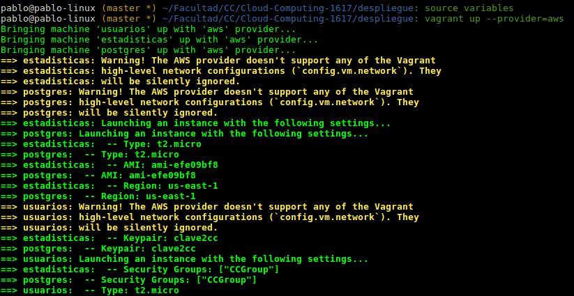
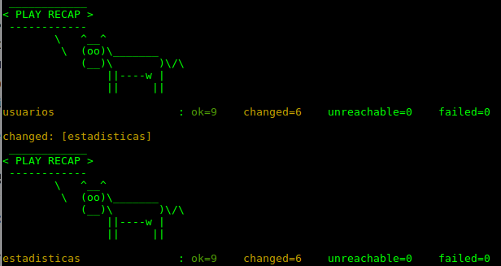

# Despliegue

## Estructura

Para el despliegue finalmente se han utilizado 3 MV de AWS y un servicio de log (papertrail).

1. Jugadores
2. Estadísticas
3. Base de datos
4. papertrail

Las tres corren bajo Ubuntu, las dos primeras utilizan un docker de django para la aplicación y la base de datos utilizar un docker de postgres.

## Procedimiento

Lo primero es configurar AWS para un correcto funcionamiento con vagrant.
Para ello necesitaremos crear un AMI, crear un key-pair y crear un grupo de seguridad donde habilitaremos ssh,http y https.
Con esto ya tendremos todos los valores necesarios de credenciales

Una vez tenemos todos los valores de credenciales, podremos crear un archivo que exporte a variables de entorno estos valores; algo así:
```
export AWS_ACCESS_KEY_ID='elvalordeaws'
export AWS_SECRET_ACCESS_KEY='elvalordeaws'
export AWS_SECURITY_GROUP_NAME='elvalordeaws'
export AWS_KEY_PAIR_NAME='nombredelkeypair'
export AWS_PRIVATE_KEY_PATH='rutacompletaconkeypar.pem'
```
Para exportarlas lo llamaremos de la siguiente forma:
```source 'nombrefichero'```

Descargamos vagrant 1.8.7 y el plugin de AWS e instalamos.
Una vez instalado hacemos un ```vagrant init``` en el directorio donde queramos crear nuestro Vagrantfile.
Y finalmente creamos un box's dummy para poder trabajar con el.
Se puede ver mejor aquí: https://github.com/mitchellh/vagrant-aws

Ahora tan solo tendremos que componer nuestro vagrantfile, indicando los valores de credenciales de AWS y las instrucciones a ejecutar.

En mi caso, creo las MV, llamo a un script para instalar python para que funcione Ansible y por último llamo a un playbook para crear un docker con lo necesario (django/postgres).

## Resultados

Ejecutando
```vagrant up --provider=aws```
Comenzará a ejecutarse el vagrantfile con los playbooks, creando 3 MV en AWS con lo necesario.






## Papertrail

Como sistema de log se utilizaría papertrail que se integra facilmente con django.
https://docs.djangoproject.com/en/dev/topics/logging/#an-example
```
'SysLog':{
  'level':'DEBUG',
  'class':'logging.handlers.SysLogHandler',
  'formatter': 'simple',
  'address':('<host>.papertrailapp.com', 11111)
}
```
