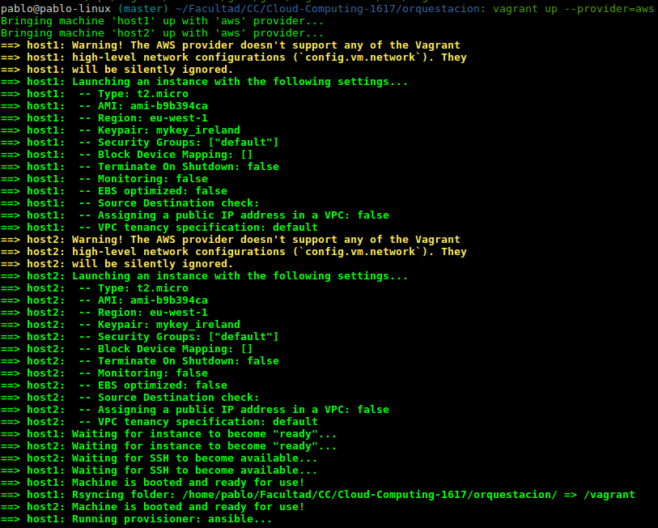
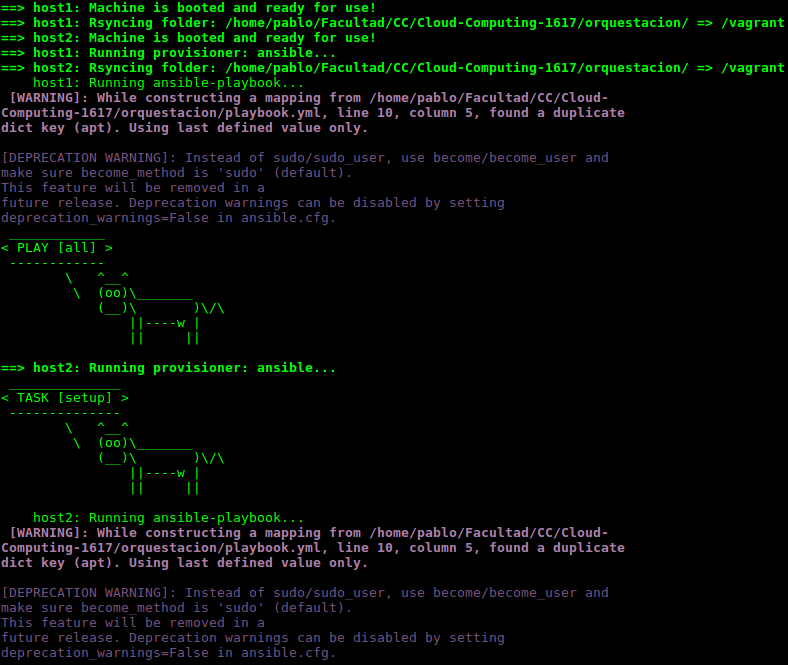
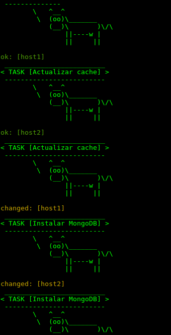

# Orquestación con Vagrant y Ansible

> Autor: Juan Pablo González Casado

#### Creamos un usuario IAM en Amazon AWS

http://docs.aws.amazon.com/AWSEC2/latest/UserGuide/get-set-up-for-amazon-ec2.html

#### Instamos vagrant 1.8.7 y el plugin para AWSEC2
Para instalar vagrant, buscamos en su web oficial.
Para instalar el plugin lo hacemos de la siguiente forma:
```
vagrant plugin install vagrant-aws
```
#### Creamos las variables de entorno con los valores del usuario

```
export ACCESS_KEY_ID='miidkey'
export SECRET_ACCESS_KEY='mikeysecreta'
export PRIVATE_KEY_NAME='mykey_ireland'
export SECURITY_GROUP='default'
export PRIVATE_KEY_PATH='/home/pablo/Facultad/mykey_ireland.pem'
```
Creamos un archivo con este contenido y ejecutamos source 'nombrearchivo', así todas se exportarán.

#### Creamos un vagrantfile

Se puede seguir la documentación para crear nuestra propia máquina con todos los valores que queramos especificar, pero en mi caso, he utilizado un script de https://github.com/mitchellh/vagrant-aws

Tan solo he modificado con mis datos, de manera que queda así:
```
# Vagrantfile
Vagrant.configure(2) do |config|

	config.vm.define :host1 do |host1|
		host1.vm.host_name = "host1"
		host1.vm.provider :aws do |aws, override|
			aws.access_key_id = ENV['ACCESS_KEY_ID']
			aws.secret_access_key = ENV['SECRET_ACCESS_KEY']
			aws.keypair_name = ENV['PRIVATE_KEY_NAME']

			aws.ami = "ami-b9b394ca"
			aws.region = "eu-west-1"
			aws.instance_type = "t2.micro"
			aws.security_groups = ["default"]

			override.vm.box = "dummy"
			override.ssh.username = "ubuntu"
			override.ssh.private_key_path = ENV['PRIVATE_KEY_PATH']
		end
		host1.vm.provision "ansible" do |ansible|
			ansible.playbook = "playbook.yml"
		end
	end

	config.vm.define :host2 do |host2|
		host2.vm.host_name = "host2"
		host2.vm.provider :aws do |aws, override|
			aws.access_key_id = ENV['ACCESS_KEY_ID']
			aws.secret_access_key = ENV['SECRET_ACCESS_KEY']
			aws.keypair_name = ENV['PRIVATE_KEY_NAME']

			aws.ami = "ami-b9b394ca"
			aws.region = "eu-west-1"
			aws.instance_type = "t2.micro"
			aws.security_groups = ["default"]

			override.vm.box = "dummy"
			override.ssh.username = "ubuntu"
			override.ssh.private_key_path = ENV['PRIVATE_KEY_PATH']
		end
		host2.vm.provision "ansible" do |ansible|
			ansible.playbook = "playbook.yml"
		end
	end

end
```
#### Utilizamos el script creado en Ansible para el hito anterior.

playbook.yml
```
- hosts: all
  sudo: true
  tasks:
  - name: Actualizar cache
    apt: update_cache=yes
  - name: Instalar MongoDB
    apt: name=mongodb state=present
  - name: Instalar Git
    apt: name=git state=present
  - name: Instalar Pip
    apt: name=python-setuptools state=present
    apt: name=python-dev state=present
    apt: name=python-pip state=present
  - name: Instalar Django
    pip: name=python-django state=presen
```

#### Elevamos las dos máquinas y ejecutamos ansible sobre ellas.

```
vagrant up --provider=aws
```

Una vez ejecutado esto iremos obteniendo lo siguiente:




Más burritos...



 Por último, si deseamos inicar cada máquina por separado haremos lo siguiente:

 vagrant ssh 'nombre'(host1/host2)
