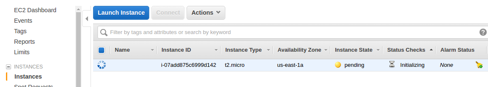
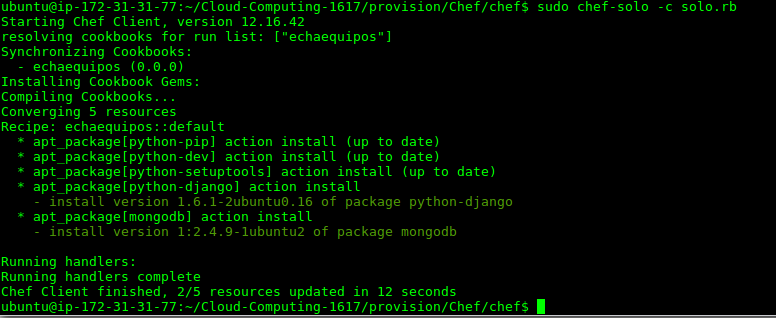
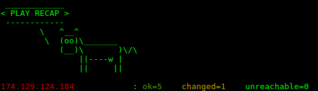

# Provisionamiento

En esta parte del proyecto se va a tratar de crear una máquina virtual con todo lo necesario para poder desplegar nuestra aplicación sin necesidad de perder mucho tiempo configurandola.

Los paquetes que vamos a necesitar que nuestra aplicación funcione correctamente serán los siguientes:
- Python
- Django
- MongoDB
- Git

Comenzemos:

1. Crear una máquina virtual de Ubuntu Server 14 en AWS

  

2. Anteriormente para los ejercicios se configuró el acceso por medio de SSH, así que accedemos a el con la cadena de conexión que nos proporciona AWS.
  ```
  ssh -i "awsubuntu.pem"
   ubuntu@ec2-54-88-214-188.compute-1.amazonaws.com
  ```

3. Instalamos Chef:

  ```
  curl -L https://www.opscode.com/chef/install.sh | sudo bash
  ```
4. Dentro de nuestro repositorio para el proyecto y dentro del directorio provisión creamos los archivos necesarios para Chef.

  ```
  mkdir -p Cloud-Computing-1617/provision/Chef/chef/cookbooks/echaequipos/recipes
  ```
5. Dentro del directorio 'chef' creamos el archivo default.rb con el siguiente contenido ('contendrá la receta'):
  ```
  package 'python-pip'
  package 'python-dev'
  package 'python-setuptools'
  package 'python-django'
  package 'mongodb'
  ```

6. Por útlimo del node.json
  ```
  {
  "run_list": [ "recipe[echaequipos]" ]
  }
  ```

7. Subimos los cambios a nuestro repositorio e instalamos git en la máquina virtual.

8. Clonamos nuestro repositorio en la máquina virtual

9. Ejecutamos chef

```
sudo chef-solo -c ~/Facultad/Cloud-Computing-1617/provision/Chef/chef/solo.rb
```
  


### Provisionamiento con Ansible

Vamos a realizar el provisionamiento también en Ansible.

1. Instalamos Ansible en nuestra máquina en local
```
sudo apt-get install ansible
```

2. Creamos el fichero ~/.ansible_host:
  ```
  [Ubuntu]
  104.40.149.210 ansible_ssh_user='pablo126' ansible_ssh_public_key_file=~/ssh/id_rsa
  ```

3. Añadimos la variable de entorno de ansible:
  ```
  export ANSIBLE_HOST=~/.ansible_hosts
  ```
4. Ejecutamos Ansible
  ```
  ansible-playbook -i .ansible_hosts --private-key key.pem -b playbook.yml
  ```

  
